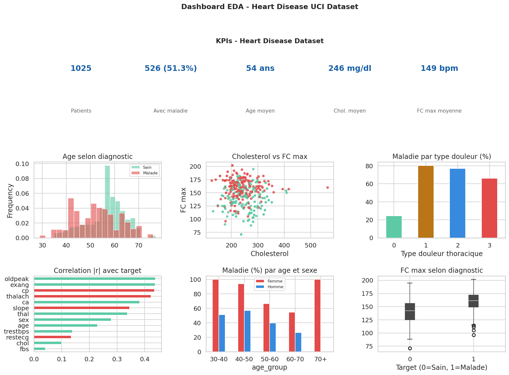

# Heart Disease Risk Analysis — UCI Dataset


## Overview

Complete exploratory data analysis (EDA) on the UCI Heart Disease dataset.
The goal is to identify the main risk factors associated with heart disease
using statistical methods and machine learning pipelines.

---

## Dataset

| Property | Value |
|---|---|
| Source | Kaggle — Heart Disease UCI |
| Patients | 1025 |
| Variables | 14 |
| Missing values | 0 |
| Target | `target` (1=Heart disease, 0=Healthy) |
| Class balance | 51.3% positive / 48.7% negative |
| Male patients | 70% |
| Mean age | 54 years |

---

## Methodology — 8 Steps

| Step | Description | Tools |
|---|---|---|
| 1 | Data overview : shape, dtypes, missing values | pandas describe() |
| 2 | Continuous variables : histogram + KDE + box plot | matplotlib seaborn |
| 3 | Categorical variables : frequency charts | pandas value_counts |
| 4 | Bivariate analysis : distributions by target class | scipy t-test chi2 |
| 5 | Correlation matrix Pearson | seaborn heatmap |
| 6 | Statistical tests on all variables | scipy.stats |
| 7 | Pairplot top 4 variables | seaborn pairplot |
| 8 | Final dashboard 6 panels | matplotlib gridspec |

---

## Key Findings

### Risk Factors (positive correlation with disease)

| Variable | Pearson r | Interpretation |
|---|---|---|
| `cp` | +0.435 | Chest pain type strongly linked to disease |
| `thalach` | +0.423 | Higher max heart rate linked to disease |
| `slope` | +0.346 | ST segment slope pattern |
| `restecg` | +0.134 | Abnormal ECG results |

### Protective Factors (negative correlation with disease)

| Variable | Pearson r | Interpretation |
|---|---|---|
| `fbs` | -0.041 | Negative association with disease |
| `chol` | -0.100 | Negative association with disease |
| `trestbps` | -0.139 | Negative association with disease |
| `age` | -0.229 | Younger patients less affected |
| `sex` | -0.280 | Female patients less affected |
| `thal` | -0.338 | Normal thalassemia = healthier |

### Key Observations
- Diseased patients have significantly higher max heart rate : **159 vs 139 bpm** (p < 0.001)
- Chest pain type 2 is the strongest categorical predictor
- Male patients represent **70%** of the dataset
- Dataset is well-balanced : **51.3%** positive cases
- No missing values — dataset ready for modeling

---

## Statistical Tests Summary

| Variable | Test | p-value | Significance |
|---|---|---|---|
| `age` | t-test | 0.0000 | *** |
| `trestbps` | t-test | 0.0000 | *** |
| `chol` | t-test | 0.0014 | ** |
| `thalach` | t-test | 0.0000 | *** |
| `oldpeak` | t-test | 0.0000 | *** |
| `sex` | chi-squared | 0.0000 | *** |
| `cp` | chi-squared | 0.0000 | *** |
| `fbs` | chi-squared | 0.2186 | ns |
| `restecg` | chi-squared | 0.0000 | *** |
| `exang` | chi-squared | 0.0000 | *** |
| `slope` | chi-squared | 0.0000 | *** |
| `ca` | chi-squared | 0.0000 | *** |
| `thal` | chi-squared | 0.0000 | *** |

---

## Visualizations

### EDA Dashboard


---

## Project Structure

```
projet_diabete_madagascar/
    README.md                        <- This file
    notebook_eda_heart_08.ipynb      <- Complete EDA notebook
    notebook_readme_09.ipynb         <- This README generator
    notebook_projet_07.ipynb         <- Full ML pipeline on PostgreSQL data
    heart.csv                        <- UCI Heart Disease dataset
    dashboard_heart_eda.png          <- EDA dashboard
    dashboard_diabete.png            <- Diabetes analysis dashboard
    predictions_diabete.csv          <- ML model predictions
```

---

## Technologies

```
Python 3.11 | pandas | numpy | matplotlib | seaborn
scipy | statsmodels | scikit-learn
PostgreSQL 18 | psycopg2 | SQLAlchemy
```

---

## How to Run

```bash
git clone https://github.com/odijoa5-create/projet_diabete_madagascar.git
cd projet_diabete_madagascar
conda create -n formation_data python=3.11
conda activate formation_data
pip install pandas numpy matplotlib seaborn scipy statsmodels scikit-learn jupyter
jupyter notebook
```

---

## Next Steps

- [ ] Machine Learning modeling (Random Forest, Gradient Boosting)
- [ ] Hyperparameter tuning with GridSearchCV
- [ ] SHAP values for model explainability
- [ ] SIR/SEIR epidemiological model
- [ ] Streamlit interactive dashboard

---

## Author

**Joachin** — Data Analyst / Data Scientist
Master in Numerical Analysis | PhD candidate in Computational Epidemiology
GitHub : [odijoa5-create](https://github.com/odijoa5-create)
